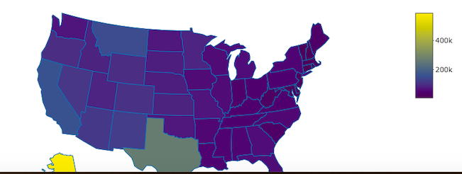

```{r setup, include=FALSE}
knitr::opts_chunk$set(echo = FALSE)
```

## Table of Contents

1. Purpose of the State Investigation APP
2. Usage of the State Investigation APP
3. Link to the State Investigation APP

## Purpose of the State Investigation APP

The purpose of the State Investigation APP is twofold

1. Allowing any user to investigate the state data in the state.x77 dataset through a simple web interace
2. Showing an interactive Shiny web app that meets the requirements of the assignment

Here's a sample of the state.x77 dataset:
```{r}
head(state.x77)
```

## Usage of the State Investigation APP
In the left panel of the APP you can select an x and y variable that will be used to create a scatterplot of the two variables selected. And you can enter an x value that will be used to calculate a prediction value. 


In the main panel on the right a scatterplot graph will be created based on the selected x and y variables. Furthermore a simple regression line is plotted in the graph as well as a blue horizontal and vertical line based on the entered x value for prediction and the predicted y value. Below the graph the prediction value of the entered x value is calculated (if possible)


Bewow the graph a map of the US is shown with its various states. If you hover over a state a text will be shown with the values of the selected x and y variables for that specific state.



## Link to the APP
The APP can be reached by clicking on this link [State Investigation APP](https://remcoebekker.shinyapps.io/stateinvestigationapp/)